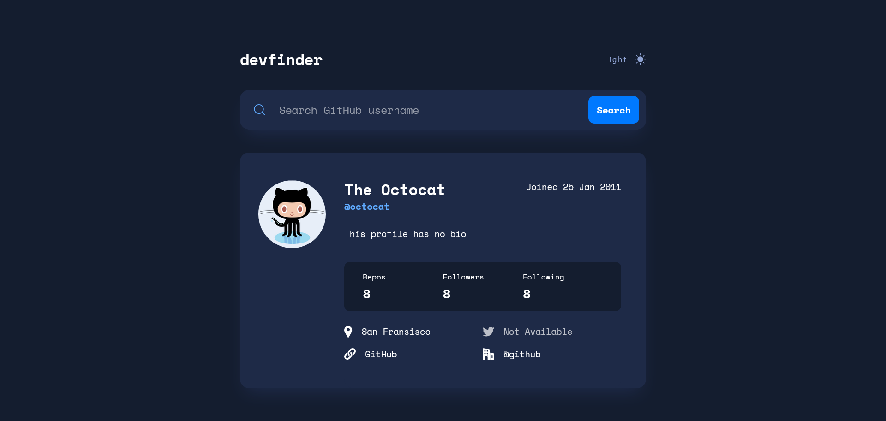

# Frontend Mentor - GitHub user search app solution

This is a solution to the [GitHub user search app challenge on Frontend Mentor](https://www.frontendmentor.io/challenges/github-user-search-app-Q09YOgaH6). Frontend Mentor challenges help you improve your coding skills by building realistic projects. 

## Table of contents

- [Overview](#overview)
  - [The challenge](#the-challenge)
  - [Screenshot](#screenshot)
  - [Links](#links)
- [My process](#my-process)
  - [Built with](#built-with)
  - [What I learned](#what-i-learned)
  - [Continued development](#continued-development)
- [Author](#author)

## Overview

### The challenge

Users should be able to:

- View the optimal layout for the app depending on their device's screen size
- See hover states for all interactive elements on the page
- Search for GitHub users by their username
- See relevant user information based on their search
- Switch between light and dark themes
- **Bonus**: Have the correct color scheme chosen for them based on their computer preferences. _Hint_: Research `prefers-color-scheme` in CSS.

### Screenshot



### Links

- Solution URL: [Add solution URL here](https://your-solution-url.com)
- Live Site URL: [Add live site URL here](https://your-live-site-url.com)

## My process

### Built with

- Semantic HTML5 markup
- CSS custom properties
- Flexbox
- CSS Grid
- Mobile-first workflow
- JavaScript
- Github API

### What I learned

During this project I learned how create a dark-mode toggle and how to fetch user data from the GitHub API. I also learned how to set eventlisteners using a for-loop. Moreover I figured out how to handle focus and blur events.

Here is an example of my JS code:

```js
function addFocusStyleLinks(){
    const links = document.getElementsByTagName("a")

    for(let i = 0; i < links.length; i++){
        links[i].addEventListener("focus", highlight)
        
    }
}

function highlight(e){
    e.target.style.outline = "none"
    e.target.closest("div").style.outline = "2px solid var(--blue-500)"
} 
```

### Continued development

In the future I want to work on making the site more accessible. I also want to add comments to make the code more readable.

## Author

- Website - [Jan Lindner](https://jans-learning-journal.netlify.app/)
- Frontend Mentor - [@jn123l](https://www.frontendmentor.io/profile/jn123l)

